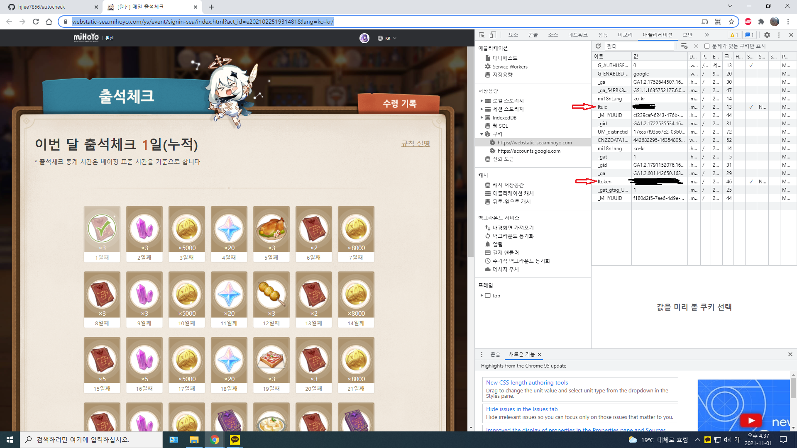
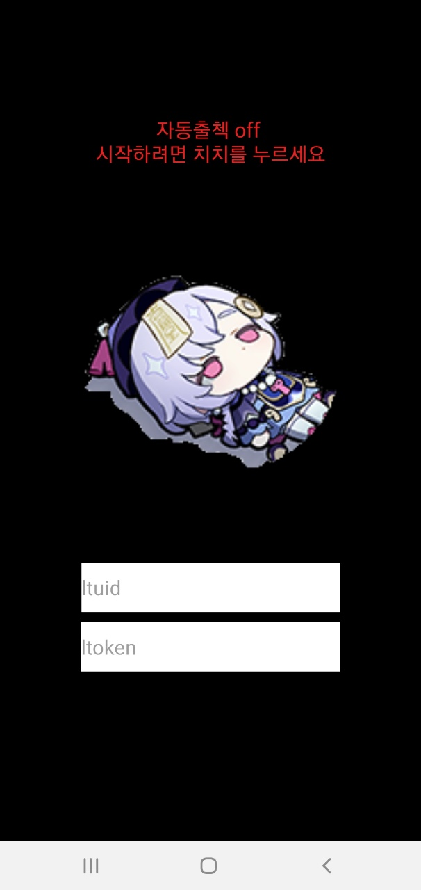
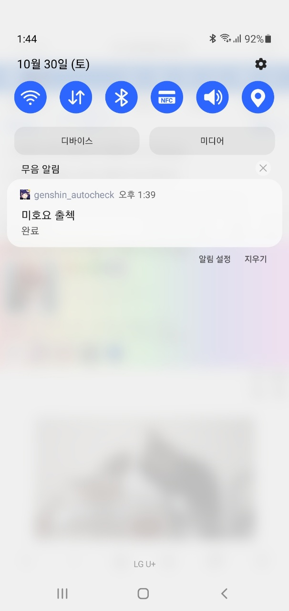

# autocheck (미호요 원신 자동출석 앱)

안드로이드용

# 사용법
1. https://webstatic-sea.mihoyo.com/ys/event/signin-sea/index.html?act_id=e202102251931481&lang=ko-kr 접속 및 로그인
2. 크롬에서 F12 눌러서 개발자도구를 열고 애플리케이션 -> 쿠키 -> webstatic-sea.mihoyo.com -> ltoken과 ltuid 확인

3. 위에서 확인한 ltoken과 ltuid 입력 후 치치를 눌러 시작(바로 1회 출석됨)

4. 누른 시각으로 부터 24시간마다 알림과 함께 자동으로 출석됨

